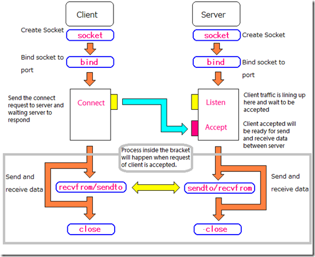

Networking
==========

`ipaddress <https://docs.python.org/3.4/library/ipaddress.html>`_ - IPv4/IPv6 manipulation library
--------------------------------------------------------------------------------------------------

::

  >>> ipaddress.ip_address('192.168.0.1')
  IPv4Address('192.168.0.1')
  >>> ipaddress.ip_address('2001:db8::')
  IPv6Address('2001:db8::')

  >>> ipaddress.ip_network('192.168.0.0/28')
  IPv4Network('192.168.0.0/28')

  >>> IPv4Address('127.0.0.2') > IPv4Address('127.0.0.1')
  True
  >>> IPv4Address('127.0.0.2') == IPv4Address('127.0.0.1')
  False
  >>> IPv4Address('127.0.0.2') != IPv4Address('127.0.0.1')
  True

  >>> list(ip_network('192.0.2.0/29').hosts())  
  [IPv4Address('192.0.2.1'), IPv4Address('192.0.2.2'),
   IPv4Address('192.0.2.3'), IPv4Address('192.0.2.4'),
   IPv4Address('192.0.2.5'), IPv4Address('192.0.2.6')]

  >>> for addr in IPv4Network('192.0.2.0/28'):
  ...   addr
  ...
  IPv4Address('192.0.2.0')
  IPv4Address('192.0.2.1')
  IPv4Address('192.0.2.2')
  IPv4Address('192.0.2.3')
  IPv4Address('192.0.2.4')
  IPv4Address('192.0.2.5')
  IPv4Address('192.0.2.6')
  IPv4Address('192.0.2.7')
  IPv4Address('192.0.2.8')
  IPv4Address('192.0.2.9')
  IPv4Address('192.0.2.10')
  IPv4Address('192.0.2.11')
  IPv4Address('192.0.2.12')
  IPv4Address('192.0.2.13')
  IPv4Address('192.0.2.14')
  IPv4Address('192.0.2.15')

  >>> IPv4Network('192.0.2.0/28')[0]
  IPv4Address('192.0.2.0')
  >>> IPv4Network('192.0.2.0/28')[15]
  IPv4Address('192.0.2.15')
  >>> IPv4Address('192.0.2.6') in IPv4Network('192.0.2.0/28')
  True
  >>> IPv4Address('192.0.3.6') in IPv4Network('192.0.2.0/28')
  False

socket
------

APIs
~~~~

:TCP:
  http/https, ftp/sftp, smtp, imap, pop3, ssh

:UDP:
  dns, nfs, dhcp, rip

- socket
- bind
- connect
- listen
- accept
- recv
- send
- close

server1.py and (client1.py or browser)

ab - Apache HTTP server benchmarking tool::

  $ ab -n 5 -c 5 http://localhost:8000/
  This is ApacheBench, Version 2.3 <$Revision: 655654 $>
  Copyright 1996 Adam Twiss, Zeus Technology Ltd, http://www.zeustech.net/
  Licensed to The Apache Software Foundation, http://www.apache.org/

  Benchmarking localhost (be patient).....done

  Server Software:
  Server Hostname:        localhost
  Server Port:            8000

  Document Path:          /
  Document Length:        58 bytes

  Concurrency Level:      5
  Time taken for tests:   15.007 seconds
  Complete requests:      5
  Failed requests:        0
  Write errors:           0
  Total transferred:      510 bytes
  HTML transferred:       290 bytes
  Requests per second:    0.33 [#/sec] (mean)
  Time per request:       15006.968 [ms] (mean)
  Time per request:       3001.394 [ms] (mean, across all concurrent requests)
  Transfer rate:          0.03 [Kbytes/sec] received

  Connection Times (ms)
                min  mean[+/-sd] median   max
  Connect:        0    0   0.2      0       1
  Processing:  3001 9003 4745.5  10504   15006
  Waiting:        1 6002 4745.2   7503   12005
  Total:       3001 9004 4745.6  10505   15007

  Percentage of the requests served within a certain time (ms)
    50%   9004
    66%  12005
    75%  12005
    80%  15007
    90%  15007
    95%  15007
    98%  15007
    99%  15007
   100%  15007 (longest request)

Multithreading or processing
~~~~~~~~~~~~~~~~~~~~~~~~~~~~

Apache

server2.py::

  ab -n 5 -c 5 http://localhost:8000/
  This is ApacheBench, Version 2.3 <$Revision: 655654 $>
  Copyright 1996 Adam Twiss, Zeus Technology Ltd, http://www.zeustech.net/
  Licensed to The Apache Software Foundation, http://www.apache.org/

  Benchmarking localhost (be patient).....done

  Server Software:
  Server Hostname:        localhost
  Server Port:            8000

  Document Path:          /
  Document Length:        58 bytes

  Concurrency Level:      5
  Time taken for tests:   3.004 seconds
  Complete requests:      5
  Failed requests:        0
  Write errors:           0
  Total transferred:      510 bytes
  HTML transferred:       290 bytes
  Requests per second:    1.66 [#/sec] (mean)
  Time per request:       3004.066 [ms] (mean)
  Time per request:       600.813 [ms] (mean, across all concurrent requests)
  Transfer rate:          0.17 [Kbytes/sec] received

  Connection Times (ms)
                min  mean[+/-sd] median   max
  Connect:        0    0   0.1      0       0
  Processing:  3002 3003   0.5   3003    3004
  Waiting:        1    2   0.7      2       3
  Total:       3003 3003   0.4   3003    3004

  Percentage of the requests served within a certain time (ms)
    50%   3003
    66%   3003
    75%   3003
    80%   3004
    90%   3004
    95%   3004
    98%   3004
    99%   3004
   100%   3004 (longest request)

Multiplexing
~~~~~~~~~~~~

server3.py

- select
- poll
- epoll
- kqueue

Blocking & Non-Blocking

Nginx, NodeJS, Twisted/Tornado

See: `The C10K problem <http://www.kegel.com/c10k.html>`_

http
----

server side::

  import http.server
  import socketserver

  PORT = 8000

  Handler = http.server.SimpleHTTPRequestHandler

  httpd = socketserver.TCPServer(("", PORT), Handler)

  print("serving at port", PORT)
  httpd.serve_forever()

::

  $ python -m http.server 8000

  $ python -m http.server 8000 --bind 127.0.0.1

client side::

http.client::

  >>> import http.client
  >>> conn = http.client.HTTPConnection("www.python.org")
  >>> conn.request("GET", "/index.html")
  >>> r1 = conn.getresponse()
  >>> print(r1.status, r1.reason)
  200 OK
  >>> data1 = r1.read()  # This will return entire content.

requests & requests-cache::

  >>> import requests
  >>> res = requests.get('http://www.python.org')
  >>> res.status_code, res.reason
  (200, 'OK')
  >>> res.content[:100]
  b'<!doctype html>\n<!--[if lt IE 7]>   <html class="no-js ie6 lt-ie7 lt-ie8 lt-ie9">   <![endif]-->\n<!-'

  >>> import requests_cache
  >>> requests.install_cache()
  >>> import requests
  >>> requests.get('http://www.python.org')   # a bit slow
  <Response [200]>
  >>> requests.get('http://www.python.org')   # very quick
  <Response [200]>

::

  $ ls cache.sqlite
  cache.sqlite

xmlrpc
------

server side::

  from xmlrpc.server import SimpleXMLRPCServer
  from xmlrpc.server import SimpleXMLRPCRequestHandler

  # Restrict to a particular path.
  class RequestHandler(SimpleXMLRPCRequestHandler):
      rpc_paths = ('/RPC2',)

  # Create server
  server = SimpleXMLRPCServer(("localhost", 8000),
                              requestHandler=RequestHandler)
  server.register_introspection_functions()

  # Register pow() function; this will use the value of
  # pow.__name__ as the name, which is just 'pow'.
  server.register_function(pow)

  # Register a function under a different name
  def adder_function(x,y):
      return x + y
  server.register_function(adder_function, 'add')

  # Register an instance; all the methods of the instance are
  # published as XML-RPC methods (in this case, just 'mul').
  class MyFuncs:
      def mul(self, x, y):
          return x * y

  server.register_instance(MyFuncs())

  # Run the server's main loop
  server.serve_forever()

client side::

  import xmlrpc.client

  s = xmlrpc.client.ServerProxy('http://localhost:8000')
  print(s.pow(2,3))  # Returns 2**3 = 8
  print(s.add(2,3))  # Returns 5
  print(s.mul(5,2))  # Returns 5*2 = 10

  # Print list of available methods
  print(s.system.listMethods())

Celery

Twisted
-------

gevent
python-eventlet
tulip(asyncio)
Scrapy
