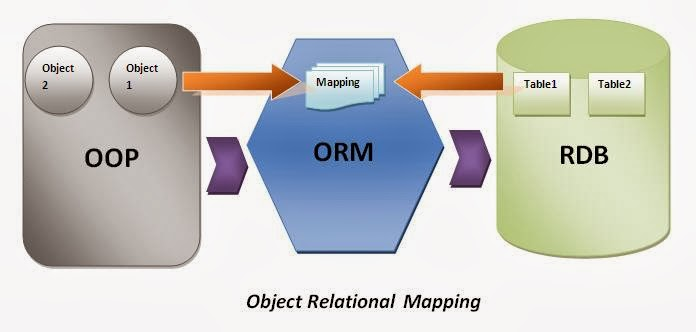

Databases
=========

SQL
---

101
~~~

creation

  CREATE TABLE table_name(field type, ..)

types

  int, float, text, blob, varchar, char, datetime, date, time

  autoincrement

querying

  SELECT field, .. FROM table WHERE field = value, .. ORDER BY field GROUP BY field HAVING field ..

  WHERE: filter by row
  ORDER BY: fields DESC, ASC
  GROUP BY: fields
  HAVING: filter by group

modification

  INSERT INTO table(field, ..) VALUES(value, ..), ..

  UPDATE table SET field = value, .. WHERE field = value and ... or ...

  REPLACE table

  DELETE FROM table WHERE field = value

transaction

  BEGIN, COMMIT, ROLLBACK

  autocommit

keys

  primary key, condidate key, foreign key

  index, unique, combined indexes(keys)

relationship

  1:1, 1:n, n:n

sqlite
~~~~~~

::

  >>> import sqlite3
  >>> conn = sqlite3.connect('cache.sqlite')
  >>> c = conn.cursor()
  >>> c.execute('select key from urls')
  <sqlite3.Cursor object at 0x103093f80>
  >>> c.fetchone()
  ('89b1b81005c639109c2248db8161bb0b903ad117561e28a162c3e55b7e5d6ca8',)

  >>> for row in c.execute('select key from urls'): print(row)
  ...
  ('89b1b81005c639109c2248db8161bb0b903ad117561e28a162c3e55b7e5d6ca8',)
  ('c84998697121613e70ae1e68a5ba515718cb78c82b711cd337a1669baf8d1c66',)

::

  # console 1
  >>> conn = sqlite3.connect('test')
  >>> c = conn.cursor()
  >>> c.execute('create table test(key int, value varchar(32))')
  <sqlite3.Cursor object at 0x102828f80>
  >>> c.execute("insert into test values(1, 'a'), (2, 'b')")
  <sqlite3.Cursor object at 0x102828f80>

  # console 2
  $ sqlite3 test
  SQLite version 3.7.13 2012-07-17 17:46:21
  Enter ".help" for instructions
  Enter SQL statements terminated with a ";"
  sqlite> .tables
  test
  sqlite> select * from test;

  # console 1
  >>> conn.commit()

  # console 2
  sqlite> select * from test;
  1|a
  2|b

MySQLdb
~~~~~~~

PostgreSQL
~~~~~~~~~~

ORM
---

SQLAlchemy
~~~~~~~~~~

Django ORM
~~~~~~~~~~

Relation DB vs. NoSQL
---------------------

.. image:: nosql_cap.png

See `CAP theorem <http://en.wikipedia.org/wiki/CAP_theorem>`_

.. image:: dbs.jpg

Mongo
~~~~~

Redis
~~~~~

Memcache
~~~~~~~~
